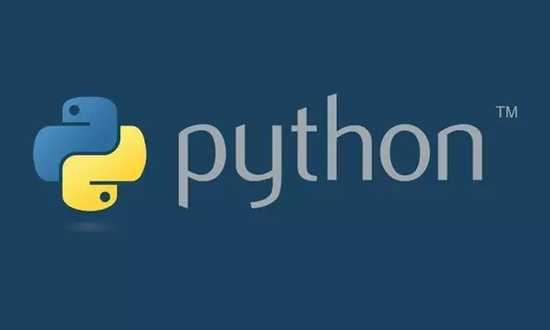

## PythonDevNote
**项目说明：`Python3`学习笔记。（持续不定期更新。。。）**




## 学习推荐
- [**ZOE's MindMap**](https://woaielf.github.io/)--【思维脑图，强烈推荐】


## 安装说明
- [Windows10下python3和python2同时安装（一）安装python3和python2](http://blog.csdn.net/qiang12qiang12/article/details/53239734)
- [Windows10下python3和python2同时安装（二）python2.exe、python3.exe和pip2、pip3设置](http://blog.csdn.net/qiang12qiang12/article/details/53239866)
- [Windows10下python3和python2同时安装（三）VS 2013配置python环境](http://blog.csdn.net/qiang12qiang12/article/details/53240106)
- [python2 手动安装更新pip](http://blog.csdn.net/qiang12qiang12/article/details/76216399)
- [同时安装Python2和Python3，使之共存](https://www.cnblogs.com/tk2049jq/p/7043480.html)


## License
```
Copyright (c) 2018, The Jeterlee authors 

   Licensed under the Apache License, Version 2.0 (the "License");
   you may not use this file except in compliance with the License.
   You may obtain a copy of the License at

       http://www.apache.org/licenses/LICENSE-2.0

   Unless required by applicable law or agreed to in writing, software
   distributed under the License is distributed on an "AS IS" BASIS,
   WITHOUT WARRANTIES OR CONDITIONS OF ANY KIND, either express or implied.
   See the License for the specific language governing permissions and
   limitations under the License.
```
